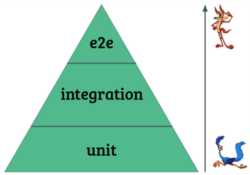

&nbsp;

 
 

<h2 align="justify">React: testando os seus componentes</h2>
<h2 align="justify">Feito por : Thiago Zambelli</h2>
<h3 align="justify">Entrando no mundo dos testes para React JS/TS</h3>
 
  

- [Projeto](#projeto)
- [Problemas e Soluções](#problemas__solucoes)
- [Aulas](#aulas)

&nbsp;

---

# Projeto -> 

## Ideia do projeto:
> O projeto consiste em aprender a  criar e manipular testes para os componentes React. Para isso sera utilizado o JEST e a biblioteca nativa de testes do React!

&nbsp;

## TDD
> TEST DRIVEN DEVELOPMENT (Desenvolvimento Orientado a Teste), baseia-se em desenvolver a apalicação se orientando pelo teste. Para isso estamos criando os testes e logo apos, fazemos o desencolvimento dos componentes usando como `regra de negocio` o que foi passado nos testes.

&nbsp;

## Realizar as buscas pelas ´Roles´:
> Realizar as buscas pelas roles é uma boa prática porque, além de testar a sua aplicação, você garante a sua acessibilidade. As especificações relacionadas à acessibilidade estão definidas na W3C (World Wide Web Consortium) como WAI-ARIA.

> WAI-ARIA quer dizer Accessible Rich Internet Applications (Aplicações Ricas para uma Internet Acessível). O conjunto ARIA oferece a maneira de tornar as aplicações mais acessíveis a uma maior diversidade de pessoas, incluindo quem utiliza tecnologias assistivas, como leitores de telas e lentes de aumento.

> [Aqui você confere uma lista de todas as possíveis roles.](https://www.w3.org/TR/wai-aria-1.1/#role_definitions)

&nbsp;

## Piramide de Teste
  >
  
> Unidade > Serviço > Interface
  - Unidade: ALtavelocidade em desenvolver e testar, pos e feito para se usar em cada unidade do componente alem de ser mais barato.
  - Serviço: Teste feito com diversoso componentes ao mesmo tempo (um serviço).
  - Interface: mais caro e mais demorado dos testes. 

&nbsp;

## AAA (Arrange, Act and Assert em inglês)
> Padrao utilizado para criação de teste:
~~~JavaScript
  test('um nome que descreve o que vamos testar', () => {
    // arrumamos o cenário (por exemplo, renderizar um componente, buscamos componentes)

    // agimos (realizamos clicks, definimos valores)

    // afirmamos o que queremos (onde realizamos as expectativas)
})
~~~

&nbsp;

---

# Problemas e Soluções -> 

## Absolut Import:
> Para que possa usar o absolut import apartir do src fou colocado dentro do arquivo `tsconfig.json` dentro de `compilerOptions` um parametro `"baseUrl": "src",`.

&nbsp;

## Foco da aplicação:
> Um do resquesitos de teste era que ao submeter o formulario o foco fosso voltado para o input novamente. Para solucionar isso foi utilisado um hook do react chamado `useRef` que referenciou o input. Dentro do onSubmit foi passdo:

  ~~~JavaScript
    inputRef.current?.focus();
  ~~~

&nbsp;

---

&nbsp;

# Aulas -> 

## Aula 1:

- Rodamos o script que executa os testes implementados;
- Encontramos elementos na tela usando a @testing-library/react;
- Analisamos a saída o script de testes;
- Diferenciamos os tipos testes existentes;
- Desenvolvemos um componente utilizando TDD.

## Aula 2:

- Instalamos as bibliotecas necessárias para gerir as rotas e o estado;
- Criamos um hook que encapsula o acesso ao estado global de participantes;
- Utilizamos o useRef para interagir com o DOM e definir foco a um input;
- Executamos código assíncrono com o setTimeout;
- Lidamos com temporizadores nos testes com Jest.
